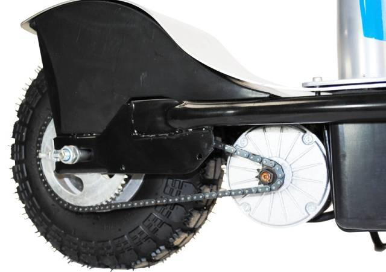
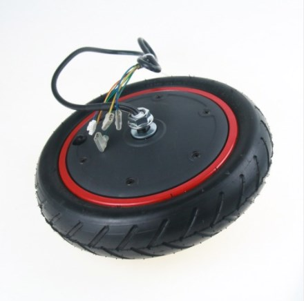

# Обзор электродвигателей

## Электродвигатели постоянного тока

 >Используются для создания регулируемых электроприводов с `высокими динамическими и эксплуатационными показателями`.
 К таким показателям относятся:
 >* высокая равномерность вращения 
 >*  перезагрузочная способность.
>
 >`Их используют для:`
 >* комплектации бумагоделательных, красильно-отделочных и подъемно-транспортных машин
 >* для полимерного оборудования
 >* буровых станков и вспомогательных агрегатов экскаваторов
 >
 >Часто они применяются для оснащения всех видов `электротранспорта`.

## Электродвигатели переменного тока
>Пользуются `более высоким спросом`, чем двигатели постоянного тока. 
>
>Практически вся домашняя бытовая техника оборудована электродвигателями переменного тока.
>
> `Их используют для:`
 >* в стиральных машинах
 >* кухонных вытяжных устройствах и т.д.
 >
 > В крупной промышленности с их помощью приводится в движение станковое оборудование, лебедки для перемещения тяжелого груза, компрессоры, `гидравлические и пневматические насосы` и промышленные вентиляторы.
 

## Шаговые электродвигатели
>Действуют по принципу преобразования электрических импульсов в механическое перемещение дискретного характера.
>
> Большинство офисной и компьютерной техники оборудовано ими. Такие двигатели очень малы, но высокопродуктивны. Иногда и востребованы в отдельных отраслях промышленности.
 

## Серводвигатели
>**`Относятся к двигателям постоянного тока`**. 
>
>Они высокотехнологичны. Их работа осуществляется посредством использования отрицательной обратной связи. 
>
>Такой двигатель отличается особой __`мощностью`__ и способен развивать `высокую скорость вращения вала`, регулировка которого осуществляется `с помощью компьютерного обеспечения`. Такая функция делает его востребованным при оборудовании поточных линий и в современных промышленных станках.
 

## Линейные электродвигатели
>*`Обладают уникальной способностью прямолинейного перемещения ротора и статора относительно друг друга.`*
>
> Такие двигатели незаменимы для работы механизмов, `действие которых основано на поступательном и возвратно-поступательном движении рабочих органов`. >
> 
>Использование линейного электродвигателя способно повысить **надежность** и **экономичность** механизма благодаря тому, что **значительно упрощает** его деятельность и почти полностью исключает механическую передачу.
 

## Синхронные двигатели
>**`Являются разновидностью электродвигателей переменного тока.`**
>
> Частота вращения их ротора равняется частоте вращения магнитного поля в воздушном зазоре.>
>
> Их используют для компрессоров, крупных вентиляторов, насосов и генераторов постоянного тока, так как `они работают с постоянной скоростью`.
## Асинхронные двигатели
>**`Относятся к категории электродвигателей переменного тока.`**
>
> Частота вращения их ротора отличается от частоты вращения магнитного поля, которое создается током обмотки статора. 
> 
> Асинхронные двигатели разделяются на два типа, в зависимости от конструкции ротора:
> * с короткозамкнутым ротором 
> * и фазным ротором. 
> >
 >`Конструкция` статора в обоих видах **одинакова**, `различие` только в **обмотке**.

# Какие двигатели используются в электросамокатах и электровелосипедах
_Далее будут рассматриваться только двигатели для электросамоката в виду  своих небольших размеров_

## **Цепной электросамокат**

Электросамокат с цепью является классической конструкцией, где крутящий момент передаётся `от электродвигателя на колесо через цепную передачу` аналогично устройству работы **велосипедов**, **скутеров**, **мотоциклов**. 

У цепных самокатов есть два взаимосвязанных преимущества: 
 * `Мощность` двигателя 
 * Способность `ездить по бездорожью` 

 Мощный двигатель не требователен к качеству дорожного покрытия, способен преодолеть препятствия как внедорожник. Чтобы защитить мотор и редуктор, их помещают в герметичный короб рядом с осью

## **Самокат с мотор-колесом**
Мотор-колесо является современным решением, когда двигатель установлен непосредственно в одном из колёс. Преимущества перед цепным устройством самоката очевидны:
* Отсутствие проблем с цепью — уязвимым звеном конструкции 
* Простота в обслуживании 
 
 Обычно электросамокат типа "мотор-колесо" имеет _`меньший вес и актуальный внешний вид`_, его проще хранить и транспортировать.

  `Недостаток такой конструкции в том, что мотор не может быть мощнее 500 Вт.`

  Такой силы двигателя достаточно для передвижения по ровным дорогам **городской среды**, а вот для загородных поездок он не предназначен.
  
   **Существует 2 типа мотор-колёс:**

  * Безредукторные имеют надёжно зафиксированные обмотки на оси, магнитное поле которых заставляет двигаться ступицу с постоянными магнитами. `Надёжная и неприхотливая в эксплуатации конструкция такого типа даёт самый большой из возможных КПД и мощность`. Её недостаток: **громоздкость и немалый вес самоката**.
  
   * С планетарным редуктором — *`более лёгкая и компактная`* альтернатива. Самокат с таким приводом не сталкивается с сопротивлением вращению из-за самоиндукции на скоростях выше 15 км/ч. Правда, `надёжность недорогих моделей с таким устройством порой оставляет желать лучшего`, *если при сборке использовались пластиковые шестерни*.

